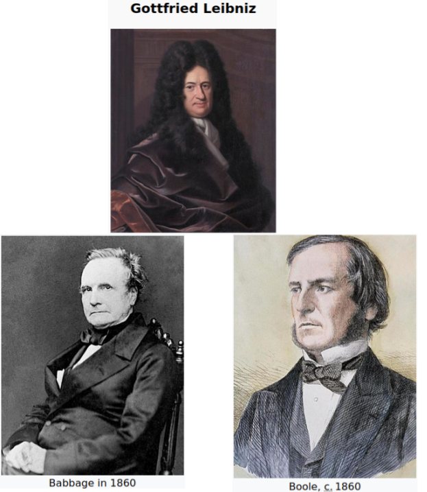
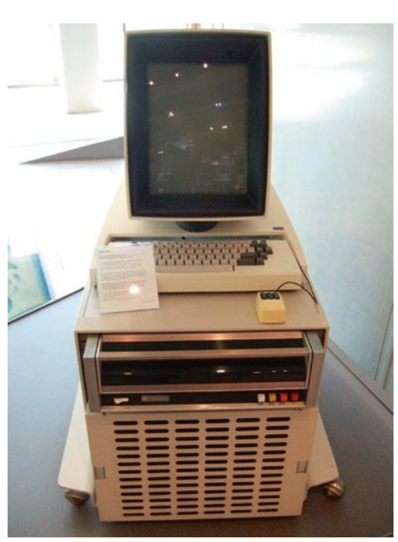

---
title:
- Orígenes de la Computación
author:
- John Sanabria - john.sanabria@correounivalle.edu.co
theme:
- Copenhagen
date:
- Noviembre, 2022
toc:
- true

header-includes:
    - \usepackage{multicol}
    - \newcommand{\hideFromPandoc}[1]{#1}
    - \hideFromPandoc{
        \let\Begin\begin
        \let\End\end
      }
    - \usepackage{xcolor}

---

# ¿Cuál es la importancia de la computación en el mundo moderno?

{width=375px}

---

## Importancia de la computación

- El mundo hoy se mueve por el **hardware + software** (smart phones, laptops, computadores personales; Windows, Android, iOS)

- El **agilismo** lo percibimos en todo momento, la necesidad de que todo se haga **rápidamente** (comunicaciones, transacciones, adquisición de bienes y servicios, etc.)
<!-- - Las comunicaciones hoy son instantáneas antes tomaba mucho tiempo mantener el contacto (cartas, mensajes orales) -->

- Las nuevas tecnologías redujeron la exposición del ser humano a ciertas actividades (envío de correos en sobres de papel) y a cierto trabajos (ir físicamente a medir la temperatura de una caldera) 

- Pero esto ha sido un proceso evolutivo

<!-- {height=30px} -->

---

# Definición de computadora

---

## Definición de computadora

---

## ¿Desde cuando el hombre hace cálculos?

--- 

### ¿Desde cuando el hombre hace cálculos?

\Begin{multicols}{2}

\scriptsize

{width=115px}

{width=135px}

{width=115px}

{width=115px}

\normalsize

\End{multicols}

---

## ¿Qué tan importante ha sido el hacer cálculos en el desarrollo de la humanidad?

{height=180px}

---

## El cerebro del ser humano esté más orientado a la creación

{height=190px}

---

# Precursores de la computación

---

## Precursores de la computación

\Begin{multicols}{2}

\scriptsize

{width=160px}

- En el siglo XVII Leibniz creó una máquina **capaz de calcular las 4 operaciones básicas** e inventó el sistema binario
- **Boole definió la lógica** sobre la cual operan los computadores actuales
- El Motor Analítico de Babbage poseía **un procesador, memoria y una forma de ingresar información y mostrar los resultados**
- [**Lady Ada Lovelace**](https://en.wikipedia.org/wiki/Women_in_computing) conoció la ideas de Babbage y afirmó que esta máquina se podría **programar** y usar para **componer música y producir gráficos** entre otros

\End{multicols}

---

# Evolución de los computadores

---

## Los primeros computadores fueron analógicos

\Begin{multicols}{2}

{height=200px}

\scriptsize

- Primeras versiones creadas al final del siglo XIX. **Se orientaron hacia las matemáticas** e.g. integración de ecuaciones diferenciales. Estas máquinas eran del tamaño de un salón y pesaban decenas de toneladas.

- Fueron usados para la **simulación** de vuelos, plantas nucleares y procesos químicos industriales 

- Se reemplazaron después de la segunda guerra mundial por computadores digitales

\normalsize

\End{multicols}

---

## El primer computador digital

\scriptsize 

- Estados Unidos, Gran Bretaña y Alemania trabajaron arduamente para desarrollar máquinas que permitieran llevar a cabo **cálculos rápidamente** y aplicar estos cálculos en el **campo de batalla** de la segunda guerra mundial 

- Los primeros computadores fueron:

\Begin{multicols}{2}
{height=120px}

\scriptsize

  - Harvard Mark I (H. Aiken e IBM, 1943) &rarr; computador **electro-mecánico** orientado a hacer cálculos rápidamente
  - Apoyaba los procesos de cálculo de ecuaciones diferenciales y balísticos. 
  - Pesaba 5 toneladas, 15 mts de largo y 2.4 mts de alto. 
  - Sumaba en menos de un segundo, multiplicaba en 6 segundos y dividía en 12 segundos

\normalsize

\End{multicols}

---

\Begin{multicols}{2}

{width=150px}

\footnotesize

  - ABC (**A**tanassof-**B**erry Computer) &rarr; orientado a la resolución de sistemas de ecuaciones lineales usando el método de Gauss, **no fue un computador de propósito general**
  - Desarrolló la idea de **máquina digital**. 
  - **Usó lógica booleana**
  - Hacía 30 adiciones y restas en un segundo
  - Por diseño se tenía separada la computación de la memoria
  - Muchos de sus conceptos fueron usados en la ENIAC

\normalsize

\End{multicols}

---

\Begin{multicols}{2}

{height=150px}

\scriptsize

  - ENIAC (Electronic Numerical Integrator And Computer) se usó para **cálculos balísticos** y **trayectorias de munición naval**
  - Era capaz de hacer 350 multiplicaciones, o 35 divisiones en un segundo, pesaba 30 toneladas
  - Usaba **tubos al vacío que se calentaban y se dañaban rápidamente**. La máquina era altamente inestable y el mayor tiempo sin daño fue de 5 días 
  - Esta máquina le tomó 6 semanas determinar si se podía desarrollar la bomba de hidrógeno, contestó **afirmativamente**
  - ENIAC requería ser **recableada físicamente**

\normalsize

\End{multicols}

---

- EDVAC, el sucesor de ENIAC, trajo la idea de **programa almacenado** y permitió que la **programación fuese más sencilla**. El concepto almacenado se debe a von Neumann.

- COLOSSUS (Bletchley Park, Inglaterra) &rarr; usado para romper el cifrado Lorenz de los alemanes. Esto llevó a la victoria del Día D
- Alan Turing trabajó en la máquina conocida como *Bombe*. [Click Aquí](https://www.historyvshollywood.com/reelfaces/imitation-game/)
- Z1, Z2, Z3 (K. Zuse, Alemania) &rarr; el primer computador programable

---

## Los primeros computadores comerciales

- Los paises que desarrollaron computadores comerciales fueron: Estados Unidos, Gran Bretaña, Alemania y Australia

- Uno de los equipos más famosos fue el UNIVAC I y fue construido **para procesar los datos** de la oficina **del Censo de Estados Unidos**

\Begin{multicols}{2}

\scriptsize 

- **Grace Murray Hopper** pionera de la programación del UNIVAC y contribuyó al desarrollo compiladores como COBOL y de estructuras de los lenguajes de programación modernos

{height=90px}

\End{multicols}

---

## Ferranti Mark I (Universidad de Manchester)

- Fue el **primer computador electrónico de propósito general**

- Se usó para **emitir sonidos** (God save the King), **jugar ajedrez**

- **Los padres de Tim Berners Lee**, trabajaron en el Mark I

---

##  Otros avances relevantes

- En 1954 se introduce el IBM 704 el cual fue un computador construido con tubos al vacío. Soportaba operaciones de **punto flotante**. Fue usado para aplicaciones científicas y comerciales 

- John Backus junto con Gene Amdhal trabajaron en el diseño del IBM 704 y del **lenguaje FORTRAN** usado hoy en día en computación científica

- El **sistema de defensa aéreo SAGE** fue un sistema usado para la defensa de ataques aéreos. Esta sistema lograba la **integración en tiempo real de diferentes fuentes de información interconectadas a través de líneas telefónicas** (fueron los inicios de las redes de computadores). 

---

# La miniaturización 

---

## La invención del transistor

- El **desarrollo de los computadores** se potenció por la **guerra fría**. El desarrollo de las armas se vería beneficiado por el desarrollo de sistemas de cómputo sofisticados

- Otro aspecto importante fue el apoyo a **los negocios, las universidades y el gobierno**. Los primeros computadores eran *mainframes* y solo adsequibles por Gobierno y grandes Universidades

---

## Transistor y su impacto en la fabricación de computadores

\Begin{multicols}{2}

{width=160px}

\scriptsize

- Shockley fue el padre del transistor junto con John Bardeen y Walter Brattain

- El transistor mostró ser **más estable** que los tubos al vacío y permitío la construcción de computadores más pequeños

- Ocho empleados que trabajaban para Shockley renunciaron por su mal manejo y se fueron a Sillicon Valley y formaron allí Fairchild Semiconductors y otras empresas 

- IBM construyó, a finales de los 50s, el IBM 7090 uno de los primeros computadores basados en transistores. Mucho más rápido, más confiable, más pequeño y **más eficiente en el consumo de energía**

- [Transistores](https://www.computerhope.com/jargon/v/vacuumtu.htm#:~:text=By%20using%20vacuum%20tubes%20instead,first%20half%20of%20the%201900s.)

\normalsize

\End{multicols}

---

## Circuitos integrados y Silicon Valley 

\scriptsize

- Los transistores trajeron beneficios considerables pero su **interconección aún era manual** y por tanto propensa a fallos. Se crea entonces el **circuito integrado**

- Los circuitos logran consolidar **billones de los transistores** que antes unos cientos de tubos al vacío llenaban un salón 

- De 1960 a 1963 se pasó de construir un circuito integrado de costo $1000 a $25

- La escala de integración de los chips (circuitos integrados):
  - SSI (inicios de los 60s) 30 transistores
  - MSI (finales de los 60s) 300 transistores
  - LSI (mediados de los 70s) alrededor de 3,000 transistores
  - VLSI (80s), 100,000 de transistores
  - ULSI, 1,000,000 de transistores

- SSI (Small Scale), MSI (Medium Scale), LSI (Large Scale), VLSI (Very Large Scale) y ULSI (Ultra Large Scale Integration)

\normalsize

---

### Ley de Moore

- La ley de Moore establece:
  - 1ra version, número de transistores por chip se **dobla cada año** (primeros 10 años del desarrollo tecnológico)
  - 2da versión, número de transistores se **dobla cada dos años**

- La ley de Moore se ha cumplido desde hace 50 años cuando se postuló

### Primeros computadores de circuito integrado

- 1967 se crea la primera calculadora capaz de +, -, \*, /

- **Circuitos integrados** se usaron **en los viajes espaciales del Apollo** y en misiles intercontinentales (e.g. Minuteman construido por MIT/Raytheon)

- La PDP 8 el primer minicomputador en usar circuitos integrados

---

### Nacimiento de Silicon Valley

\scriptsize

- Silicon Valley está localizado en la Bahía de San Francisco, en el Valle de Santa Clara

{width=150px}

- Este nombre fue acuñado en 1971 y se consolidó en los 80s cuando ocurrió el boom de la computación personal y está se desarrolló en Silicio Valley

---

\scriptsize

- **Silicon Valley nace oficialmente en el lugar donde nació Hewlett-Packard (HP)** por parte de Bill Hewlett y Dave Packard, 1938

{width=250px}

- La Universidad de Stanford ha brindado el capital humano que ha movido el desarrollo de Silicon Valley. Frederick Terma, decano de Ingeniería, motiva a sus graduados a crear empresas en Silicon Valley

- Terma es considerado el padre de Silicon Valley

\normalsize

---

## La revolución del microprocesador

\Begin{multicols}{2}

{width=130px}

\scriptsize

- El **microprocesador es el corazón de un computador moderno** y en el reside su poder computacional

- Intel crea el microprocesador en 1971 y se abre un abanico de usos para esta nueva tecnología, no solo para __el área armamentística, investigación, y gobiernos; sino para el ciudadano de a pie__

- El primer microprocesador comercial fue diseñado por Tedd Hoff (en Intel) y se conoció como Intel 4004. Tenía una unidad de procesamiento, rodeada por tres circuitos integrados, registros, puertos de E/S, y RAM. 

- El Intel 4004 se lanzó en 1971 y tenía la capacidad de cómputo equivalente a la de un ENIAC. Se vendió por $200 

\normalsize

\End{multicols}

---

- Gary Kildall vió un gran potencial en este dispositivo y creó el **primer lenguaje de programación** para este microprocesador así como también un **sistema operativo**:
  - PL/M **P**rogramming **L**anguage for a **M**icroprocessor (1973)
  - CP/M **C**ontrol **P**rogram for **M**icrocomputers (1973)

- Kildall ideó la BIOS de modo que el CP/M pudiese correr en diferentes tipos de hardware

- Kildall trabajó en el lanzamiento del Intel 8008 (1972) y el Intel 8080 de 8 bits con un costo de $360 (1974). El 8080 se convertiría en un estándar de la computación

- Motorola lanza su procesador 6800 en 1974 

---

## Computadores para el hogar

\Begin{multicols}{2}

{height=120px}

\scriptsize

- Xerox Alto es el **primer computador manejado por mouse y con interfaz gráfica** e influenció el diseño del Apple Macintosh 

- Butter Lampson (en Xerox, 1972) visualizó lo que sería una red de computadores las cuales operaban aplicaciones de manera distribuida

- A partir de las ideas de Lampson se da origen a diversos desarrollos:

  - La tecnología Ethernet
  - El editor WYSIWYG 
  - Interfaces gráficas manejadas por el mouse 
  - Impresoras láser
  - Lenguaje de programación Smalltalk

\normalsize

\End{multicols}

---

### MITS Altair 8800

\Begin{multicols}{2}

{width=150px}

\scriptsize

- Fue el primer computador personal comercial con un costo $439 y ensamblado de $621, 1974

- Este equipo no tenía teclado ni pantalla. Se programa en lenguaje de máquina y la salida de los programas se observaba a través de LEDs

- **Bill Gates y Paul Allen** desarrollaron **BASIC** para el Altair 8800, Julio 1975. Esto dió origen a la creación de **Microsoft**

\normalsize

\End{multicols}

---

### Apple I y II

\Begin{multicols}{2}

{width=150px}

\scriptsize

- **Steve Wozniak** y **Steve Jobs** conforman **Apple Computers** en 1976. Wozniak se encargaba de desarrollar los productos y Jobs de comercializarlos

 - El **Apple I** era un equipo para ensamblar y **sin teclado ni pantalla**. Apple II fue un computador listo para usar

- Lanzado en 1977, Apple II venía con BASIC y **VisiCalc** (hoja de cálculo)

\normalsize

\End{multicols}

---

### Apple Macintosh

- **Influenciado por Xerox PARC** research center (1981), el **Apple Macintosh incorporó los dispositivos de entrada y salida** que influenciaron el desarrollo de los futuros equipos de cómputo

- **Solo hasta 1990**, IBM PC incorpora el mouse

- Sin embargo Macintosh fue mucho más costoso e IBM PC venía con diferentes aplicaciones (e.g. procesador de palabras, hojas de cálculo, bases de datos, entre otros)

- Apple mantiene su popularidad, especialmente en los círculos de diseño y mercado publicitario 

---

# Software

---

## Historia de los sistemas operativos 

\scriptsize

- El sistema operativo es el programa encargado de **gestionar el hardware** del computador y de **prestar servicios** al usuario de modo que este pueda hacer uso de este hardware

- **Los primeros computadores no tenían sistema operativo** y cada usuario debería ingresar sus programas en código de máquina, un bit a la vez

- **Los sistemas operativos se construyen alrededor de 1950** con el fin de hacer un uso más **eficiente** del costoso hardware 

- Aparecen conceptos como **Multiprogramación** y la **Interrupciones** 

---

- CTSS fue un sistema operativo **interactivo**, de **tiempo compartido** y de múltiples usuarios, 1960s 

- Con Multics nace del **CTSS** y fue desarrollado por **Bell Labs**. Más adelante se desarrolla **Unix** a partir de ideas de Multics. Unix fue un sistema operativo **multi-tarea** y **multi-usuario**

- En **1981** con la entrada del IBM/PC, **IBM deja en manos de Microsoft** la creación del sistema operativo para su computador, **MS/DOS**

- Finalmente, tenemos los sistemas operativos para dispositivos móviles Android y iOS, 2007 

---

## Industria del software

\scriptsize

- **IBM** al ser uno de los precursores de la computación personal fue uno de los **mayores fabricantes y distribuidores de software**

- Inicialmente el software venía con el hardware pero **más adelante el software se convirtió en un producto en sí mismo**

- Inicialmente la **interacción** del ser humano con el computador fue **a través de leds y luego interfaces en modo texto**. Más adelante llegaron las **interfaces gráficas**
- Una rama de la computación es la **interacción humano-computador** y se preocupa por el diseño, evaluación, e implementación de sistemas interactivos para uso humano

- Hoy en día hay grandes empresas en el desarrollo de software: IBM, Microsoft, Oracle, SAP, Google (SaaS) 

---

### Sectores en la industria del software (1/2)

\footnotesize

- **Contratistas** orienados a servir a gobiernos y grandes instituciones públicas. Llevaron a cabo proyectos muy particulares pero de interés nacional, e.g. proyecto SAGE

- **Software corporativo** desarrollan software que sirven a necesidades a un indeterminado número clientes para un vasto número de tareas, e.g. COBOL, Fortran, Pascal, Ada (Advanced Computer Techniques), SAP 

- **Software personal** orientado a brindar servicios y soluciones al usuario final e.g. procesadores de palabras (WordPerfect Co.), hojas de cálculo (1-2-3 spreadsheet), video juegos, bases de datos, presentaciones

\normalsize 

---

### Sectores en la industria del software (2/2)

\footnotesize

- **Software como servicio** software orientado a empresas, usuarios finales y el cual es accesible a través de Internet, e.g. la suite de oficina de Google

- **Open Source** software abierto creado mayormente por voluntarios conectados a través de Internet, e.g. MySQL, Firefox, Apache HTTP, GNU, Free Software Foundation

- **App stores** software orientado a ciertas plataformas y puede ser desarrollado por compañías o individuos

\normalsize 

---

## Lenguajes de programación

> - ¿Qué es un lenguaje de programación?
>
> 
>   * Los lenguajes de programación son productos de software que **permiten la creación de aplicaciones**
> 
>   * Los lenguajes de programación y se pueden clasificar por generaciones
> 
>     * **1ra generación** software que es escribía con 0s y 1s. Difícil de codificar y se era propenso a cometer errores de programación
> 

---

- **2da generación** software escrito en **lenguaje assembler**. Más fácil de codificar pero seguía siendo complejo y dependiente del hardware

{width=340px} 

---

  - **3ra generación** lenguajes de propósito general usados para crear infinidad de aplicaciones, e.g. Fortran, Cobol, Java, Python, C, Go
    - Lenguajes procedurales
    - Lenguajes orientados a objetos
    - Lenguajes funcionales

  - **4ta generación** lenguajes donde se describe que se desea pero no el como hacerlo, e.g. generadores de reportes

  - **5ta generación** lenguajes por restricciones donde le programador indica las restricciones del problema y el programa encuentra la solución, e.g. Prolog (usado en Inteligencia Artificial)

---

### Paradigmas de programación 

- **Lenguajes imperativos** define la computación en términos de **estados**. Le pide al usuario que indique **como** llevar a cabo una tarea, e.g. Python, C, Assembler

- **Orientados a objetos** los programas se construyen a partir de objetos que interactúan entre sí. El programador debe escribir los objetos, e.g. Python, Java, C++

- **Lenguajes funcionales** la forma como se programa es pensando en términos de funciones. El concepto de **estado** no es relevante. Se basa en postulados matemáticos, e.g. LISP, ML

- **Lenguajes lógicos** describe **qué** es lo que tiene que ser hecho. Se basan en lógica matemática, e.g. Prolog

---

# Internet

---

## Arpanet

\footnotesize

- En los **60s habían alrededor de 10,000 computadores** en el mundo todos totalmente **desconectados entre ellos**

- En los 50s, el departamento de defensa de USA fundó ARPA (Advanced Research Projects Agency)
- En los 60s se propone la idea de **conmutación de paquetes** 
- Los primeros computadores no tenían un estándar **para representar información, se propone ASCII** (American Standard Code for Information Interchange), 1963
- Se implementa el concepto de **conmutación de paquetes** sobre canales de 56 Kbps, 1966
- En **1969 se implementan las reglas para que los computadores se comuniquen**, NCP (Network Control Protocol)

\normalsize

---

## Correo electrónico

\footnotesize 

- En **1971 aparecen Telnet y FTP**. Más tarde aparece el **correo electrónico**

- El correo electrónico trae consigo elementos característicos del Internet
  - '@' que separa al **usuario** del **computador** donde está el usuario
  - DNS (Domain Name System) que establece que un computador pertenece a un dominio u organización 
  - SMTP (Simple Mail Transfer Protocol), POP (Post Office Protocol), IMAP (Internet Message Application Protocol)

- GMAIL es una evolución en el correo ya que provee una interfaz centrada en la web

\normalsize

---

## Nacimiento de Internet

\scriptsize

- El proyecto ARPANET es clausurado y el proyecto de conectividad es retomado por la NSF (National Science Foundation)

- En 1983 se consolida el protocolo TCP/IP

- Se actualizan los canales de comunicación de 56 Kbps a 1.544 Mbps, 1988

- ANS (Advanced Network Services), empresa sin ánimos de lucro, toma la gestión de la red e incrementa el ancho de banda a 45 Mbps

- Finalizando los 80s existían alrededor de 160,000 equipos conectados 

---

## Nacimiento del World Wide Web (www)

\scriptsize 

- En 1990 Tim Berners-Lee inventa la web

- Comienza a trabajar, a mediados de los 80s, en **un proyecto que permita gestionar los documentos y los datos de la comunidad científica** en el CERN 

- Su propuesta, comenzada a mediados de los 80s, fue el hipertexto que tenía un lenguaje (**HTML - Hyper Text Markup Language**) y un protocolo para transferir los datos (**HTTP - Hyper Text Transfer Protocol**). Define el concepto de URL

- **Berners-Lee también escribió el primer navegador**: Gopher, **Mosaic** &rarr; Netscape &rarr; Internet Explorer &rarr; Mozilla, Firefox, Chrome, ...

- Berners-Lee visionaba con una web capaz de hacer mucho más que solo distribuir contenido

---

## ¿En que tareas se usa hoy la web?

---

## Las compañías 'punto com'

- Gracias al auge de la web se crean compañías alrededor de esta nueva tecnología, **aparecen las .com**

  - Yahoo (1995)
  - Amazon (1995)
  - eBay (1995)

- Se pensó en la web como el próximo "lejano oeste" a conquistar y **se sobredimensionaron capacidades** que llevaron al colapso de muchas empresas en la escena .com, 2001 

- Algo similar pasa hoy con las criptomonedas y muchas personas no entendemos cuál es su potencial, cuál es su limitante

---

## La seguridad en Internet

- Internet nace como un proyecto altruista pero gente con **propósitos no positivos para el común** hay en toda parte, incluso en Internet

- Riesgos de Internet:
  - Robo de información
  - Inoculación de software malicioso (via PDF, visita a páginas web)
  - Suplantación de identidad (phishing)
  - Suspensión de servicios (Denial of Service - Anonymous)

---

### Otra tecnologías en Internet

- **IoT** - Tecnología que se relaciona con la manera como los **datos, la computación está inmersa en nuestro ambiente** (smart home, smart city) 
  - Automatización de tareas del hogar
  - Vigilancia automatizada

- **Dinero digital** busca simplificar el manejo del dinero y este se traduce en bits/bytes en bases de datos
  - Nuevas monedas buscan sacar de la ecuación los sistemas bancarios pero no es fácil porque no es fácil confiar en quien no vemos
  - DigiCash, Paypal esquemas de pagos y de gestión del dinero
  - Apple Pay, Google Wallet son billetaras digitales donde se puede gestionar tu dinero de manera centralizada
  - Bitcoin, Ethereum, Dogecoin, dinero digital con gestión no centralizada 

---

## Redes sociales - Facebook

- Facebook (2004 - )
  - Con más de 2 billones de usuarios en 2020, Facebook es una de las redes sociales más populares
  - En Facebook **se gestó la movilización** que más tarde provocó en Egipto el derrocamiento de  Hosni Mubarack
  - El **modelo de negocio** es orientado a la publicidad 

---

## Redes sociales - Twitter

- Twitter (2006 - )
  - Es una red social de tipo **micro-blogging** (lo que puedas anunciar/publicar en 280 caracteres)
  - Tiene alrededor de **300 millones** de usuarios que emiten tweets sobre diversos temas, política, religión, cultura, tecnología, educación...
  - De aquí emerge el concepto de **hastag**. Un hashtag se puede convertir en un *trending topic*
  - Modelo de negocio basado en *promoted tweets* y venta de información relacionada con el perfil de consumo de sus usuarios

---

## *Social Media* y *Fake News*

- Es la distribución sistemática de información falsa o que puede llevar a malas interpretaciones 
- Las *fake news* pueden afectar a casi cualquier cosa o persona, gobiernos, instituciones, individuos, organizaciones, etc.
- Las *fake news* se han usado en medios impresos (edad media), radiales, televisivos, y en medios digitales hoy en día 

