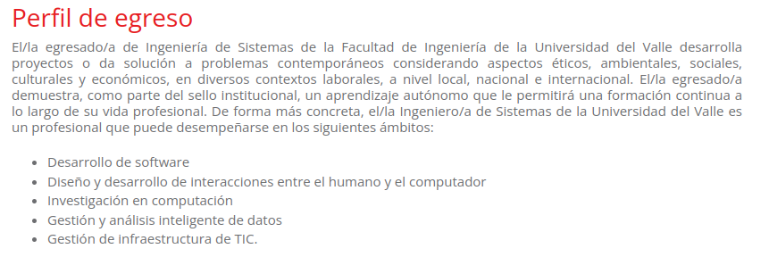
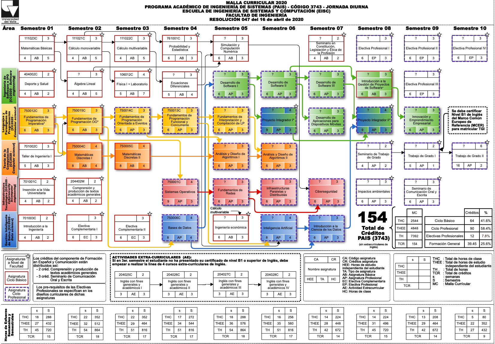

---
title:
- Ingeniería de Sistemas en la Universidad del Valle
author:
- John Sanabria - john.sanabria@correounivalle.edu.co
theme: "Antibes"
colortheme: "beaver"
urlcolor: red
linkstyle: bold
toc: true
date:
- Noviembre, 2022

header-includes:
    - \usepackage{multicol}
    - \newcommand{\hideFromPandoc}[1]{#1}
    - \hideFromPandoc{
        \let\Begin\begin
        \let\End\end
      }

---

## ¿Qué es la Ingeniería de Sistemas?

- Es la rama de la ingeniería relacionada con el **manejo de las tecnologías y los sistemas de información**. Esta contempla **las bases teóricas y metodológicas** necesarias para el diseño, la implantación, el análisis, el control, el procesamiento, el transporte, la operatividad, la toma de decisiones y la búsqueda de seguridad de los sistemas informáticos (Universia, s.f.).

---

## ¿A qué se puede dedicar un ingeniero de sistemas?

- Programador
- Desarrollador web
- Líder de infraestructura
- Analista de soporte técnico
- Especialista en inteligencia artificial y *big data*

---

## [¿Qué se estudia en la Ingeniería de Sistemas?](https://www.acm.org/binaries/content/assets/education/cs2013_web_final.pdf) ACM Computing Curricula 2013

\Begin{multicols}{3}

\scriptsize

- **Algoritmos y complejidad**
- Arquitectura y organización
- Ciencia computacional
- **Estructuras discretas**
- Gráficas y visualización
- **Interacción Humano-Computador**
- **Aseguramiento de la información y seguridad**
- **Gestión de la información**
- **Sistemas inteligentes**
- **Redes y comunicaciones**
- **Sistemas operativos**
- Desarrollo basado en plataformas
- **Computación paralela y distribuida**
- **Lenguajes de programación**
- **Fundamentos del desarrollo de software**
- Ingeniería de software
- Fundamentos de sistemas
- Aspectos sociales y **práctica profesional**

\normalsize

\End{multicols}

---

## Perfil de egreso

{width=430px}

---

## Malla curricular de Ingeniería de Sistemas

{width=350px}

---

## xxs
